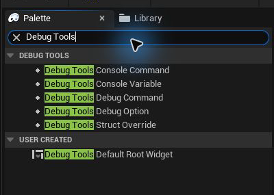

# Dashboard Widgets

Debug Tools supplies UMG controls for custom Editor Utility Widget dashboards. Find them in the **Debug Tools** palette category.

These are editor dashboard controls. They are not runtime game UI widgets and are not intended for a Shipping HUD.

---

## Debug Tools Console Command

Runs a normal console command or an `Exec` command. Configure the command, optional display label, Editor/PIE execution, parameters, and multiplayer behavior in Details.

Use this for a fixed project dashboard button when the team should not need to create the control from the Console tab first.

## Debug Tools Console Variable

Edits a bool, int, or float console variable. Configure an optional display label, multiplayer behavior, boolean presentation, and numeric bounds.

The Details panel provides a console-variable picker so the variable name does not need to be typed from memory.

## Debug Tools Debug Command

Calls a supported static or Actor-instance Blueprint-callable function. Its settings match saved [Debug Commands](/DebugTools/tabs/debug-commands): function selection, parameters, Editor/PIE policy, instance reduction, and multiplayer targeting.

## Debug Tools Debug Option

Edits a gameplay-tagged Debug Option. Configure its key, label, value type, fallback default, optional enable tag, numeric range, and multiplayer behavior.

When a project default exists for the selected key, the widget synchronizes its label, type, and default from that definition.

## Debug Tools Struct Override

Embeds the registered custom editor for one exact struct type. Supply and retrieve the struct value through its wildcard Blueprint nodes and react to **On Struct Override Value Changed**.

This is useful when the same custom struct control should appear in a project dashboard as well as inside a Save Game Override. See [Custom Save Game Struct Widgets](/DebugTools/customization/save-game-struct-widgets).

## Design-Time Behavior

The UMG Designer shows safe previews rather than attempting to run live editor or PIE operations. Open the Debug Tools panel to exercise live commands, host targeting, save data, and runtime values.

[Back to customization](/DebugTools/customization/) · [Back to home](/DebugTools/)
