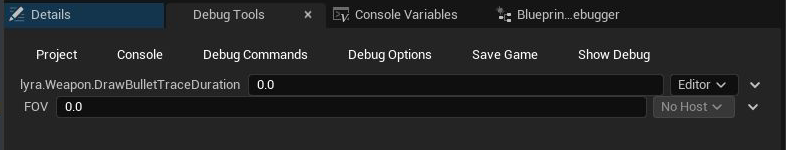
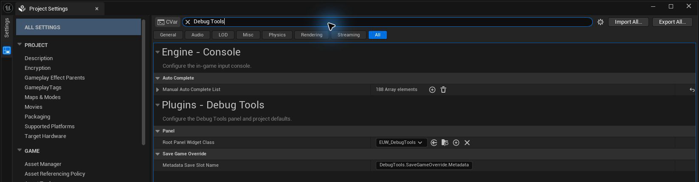

# Getting Started

## Supported Versions

Debug Tools 1.0 supports Unreal Engine 4.27 and Unreal Engine 5.0 through 5.8. The same major features are available throughout that range.

| Unreal version | Panel menu |
|----------------|------------|
| UE 4.27 | **Window -> Debug Tools** |
| UE 5.0-5.8 | **Tools -> Debug Tools** |

---

## Install and Enable the Plugin

Install the matching Debug Tools package for your engine version. A project plugin belongs at:

`YourProject/Plugins/DebugTools`

Open **Edit -> Plugins**, search for **Debug Tools**, enable it, and restart the editor when prompted.

Debug Tools enables its standard Unreal dependencies automatically. The **Gameplay Abilities** plugin is optional; enable it only if you want the [Gameplay Ability System integration](/DebugTools/gameplay-ability-system).

## Open the Panel

Open **Window -> Debug Tools** in UE 4.27 or **Tools -> Debug Tools** in UE 5.0 and later. The panel can be docked like other Unreal Editor tabs.

The panel contains six tabs: **Project**, **Console**, **Debug Commands**, **Debug Options**, **Save Game**, and **Show Debug**. The first tab hosts an Editor Utility Widget dashboard supplied by the project.

## Create Your First Console Control

1. Open the **Console** tab.
2. Search for a console command or variable, such as `debugtools.ExtraAsyncDelayMS`.
3. Select the result and click **Create Widget**.
4. Use the saved control directly from the panel.

The saved control returns the next time you open the panel. Use its gear menu to change its label, execution target, range, shortcut, or saved default when those options apply.

See [Console](/DebugTools/tabs/console) for the complete workflow.

## Configure Project Features

Open **Project Settings -> Plugins -> Debug Tools** to configure:

- the project dashboard shown in the Project tab
- whether multiplayer controls are shown
- save-game override definitions and custom struct widgets
- project defaults for Debug Options
- custom Show Debug views

Settings intended for the whole project are written to project configuration. Personal saved controls and local overrides remain local to the user. See [User Data and Persistence](/DebugTools/customization/user-data).

[Back to home](/DebugTools/)
