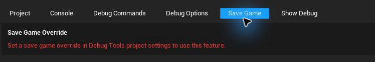

# Save Game

The Save Game tab prepares alternate `SaveGame` objects for testing. A game can load the enabled override instead of a player's normal save, letting designers reproduce progression states without overwriting real data.

---

## Configure an Override

Open **Project Settings -> Plugins -> Debug Tools** and add a **Save Game Override** definition:

- **Save Game Type**: the `SaveGame` Blueprint or C++ class to edit
- **Override Slot Name**: the separate slot used for its prepared data

Set **Metadata Save Slot Name** if the project needs a different slot for the enabled/disabled state. Slot names must be non-empty and definitions must not duplicate the same class-and-slot pair.

The current panel edits the first configured definition. Runtime loading can retain enabled state for configured definitions and selects one enabled override when asked to load.

When no definition exists, the tab points directly to the setting that must be configured:

## Prepare Save Data

1. Open the **Save Game** tab.
2. Enable **Override save**.
3. Edit the SaveGame object's properties in the details panel.

Changes are validated and saved automatically. The normal game save is not modified because Debug Tools uses the definition's separate override slot.

<!-- Screenshot needed: Save Game tab with Override save enabled and an example SaveGame object expanded. -->

## Reset an Override

Click **Reset** to replace the prepared data with a new instance of the configured Save Game Type. Use this when you want class defaults again or when an existing file belongs to a different class.

Disabling **Override save** keeps the prepared data but prevents runtime loading from selecting it.

## Status and Errors

The tab reports actionable problems, including:

- no Save Game Type or slot is configured
- a definition duplicates another definition
- the configured class cannot be created
- existing data belongs to a different SaveGame class
- the override file is unreadable or corrupt
- the file is read-only or the SaveGames directory cannot be written

Use **Reset** for wrong-class or corrupt data. Make the file writable before retrying a failed save.

## Use the Override in Your Game

Debug Tools does not replace the project's loading code automatically. Call **Load Save Game Override** before the normal load path and use its object when it succeeds.

See [Runtime Save Game Override](/DebugTools/runtime/save-game-override).

## Custom Struct Editors

The standard details panel handles reflected SaveGame properties. Projects can replace the editor for an exact struct type with an Editor Utility Widget. See [Custom Save Game Struct Widgets](/DebugTools/customization/save-game-struct-widgets).

[Back to tabs](/DebugTools/tabs/) · [Back to home](/DebugTools/)
