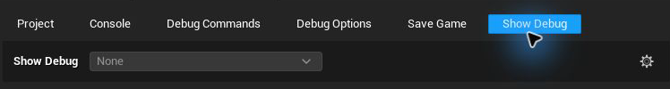

# Show Debug

The Show Debug tab provides a discoverable interface for Unreal's `ShowDebug` views. It can switch views, run category commands, expose related controls, and follow the Actor selected in the World Outliner.

---

## Select a View

Start PIE, open **Show Debug**, and select a view from the dropdown. Selecting a view resets the previous Show Debug state and runs `ShowDebug` for the new view. Select **None** to clear it.

The picker is disabled when PIE is not running.

Built-in choices include commonly available Unreal views such as AI, Animation, Bones, Camera, Collision, Game, Input, Net, and Physics. Views belonging to optional engine modules appear only when those modules are available.

<!-- Screenshot needed: Show Debug dropdown open during PIE with built-in and GAS views visible. -->

## Categories and Controls

A view can define categories beneath the picker. Selecting a category runs its configured command and displays the controls assigned to that category.

Controls can be:

- console variables, shown as bool or numeric controls with optional ranges
- console commands or exec commands with Editor/PIE policies and parameters

Those controls support the same multiplayer targeting behavior as their equivalents elsewhere in Debug Tools.

## Select the Debug Target

While a Show Debug view is active, select an Actor in the World Outliner. Debug Tools finds the corresponding PIE Actor and assigns it as Unreal's Show Debug target. Changing the selection updates the target.

Some integrations can translate that Actor into the object their debugger needs. For example, the Gameplay Ability System view can resolve from an avatar to its owning Actor.

## Add a Project View

Click the gear button in the Show Debug tab, or open **Project Settings -> Plugins -> Debug Tools -> Show Debug -> Custom Views**.

For each view, configure:

- **Display Name**: the label in the dropdown
- **Show Debug Name**: the name passed to `ShowDebug`
- **Categories**: optional labeled category commands
- **Controls**: optional console-variable, console-command, or exec-command controls

Display Name and Show Debug Name are required. Duplicate Show Debug names are ignored and reported in the tab.

## Gameplay Ability System

When Gameplay Abilities is enabled, Debug Tools adds a **Gameplay Ability System** view with **Attributes**, **Effects**, and **Abilities** categories. See [Gameplay Ability System](/DebugTools/gameplay-ability-system).

[Back to tabs](/DebugTools/tabs/) · [Back to home](/DebugTools/)
